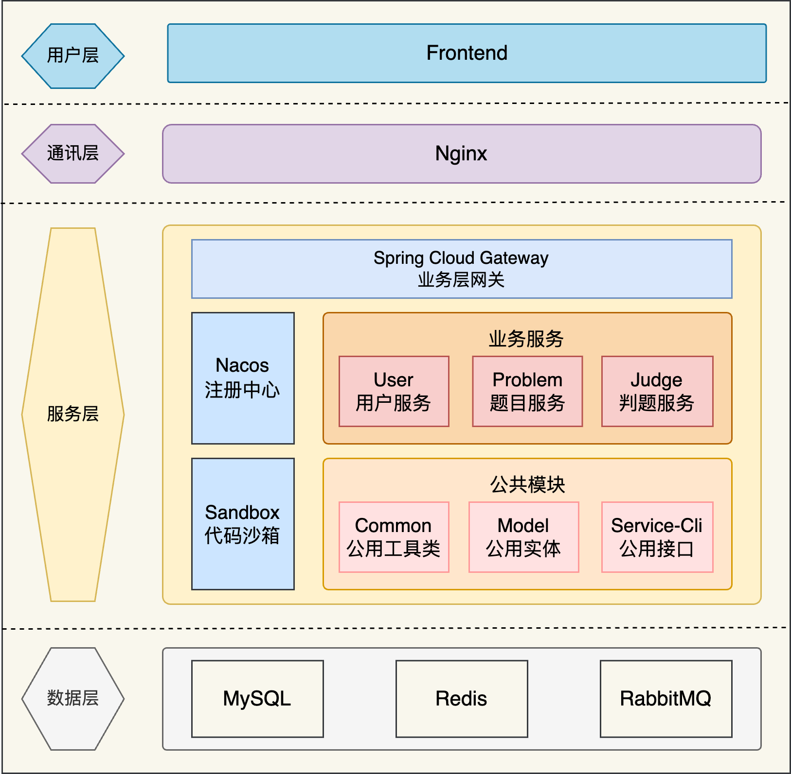
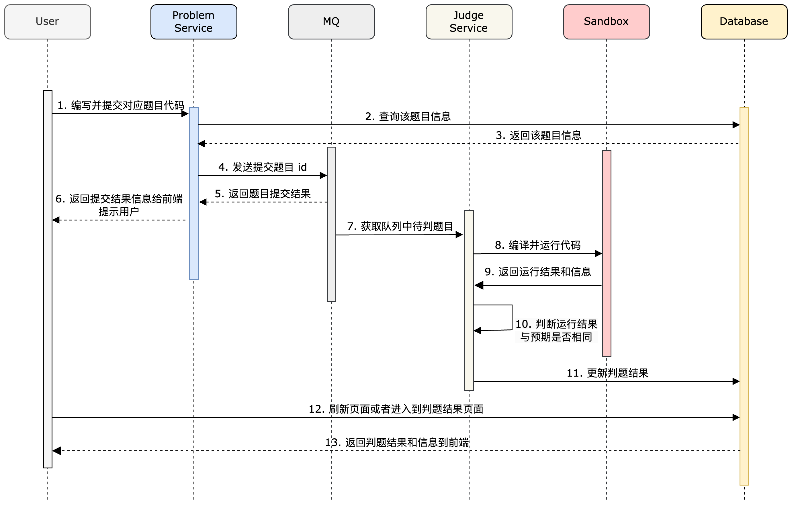

# Code OJ
### 项目介绍
基于 Spring Cloud Alibaba + Spring Boot + Docker + RabbitMQ + Redis 的在线编程评测系统。用户可以浏览题目，编写代码并将其提交进行评测。系统在代码沙箱中编译运行用户提交的代码，并根据管理员所提供的测试用例判断输出是否通过。

### 项目架构

### **业务流程**

### 主要工作
1. 使用 Spring Cloud Alibaba 重构单体项目，将项目划分题目服务、判题服务、用户服务和公共模块，并使用 Redis 分布式 Session 储存登录用户信息；
2. 使用了 Nacos + OpenFeign 实现跨服务的远程相互调用，并使用 Spring Cloud Gateway 对多个服务的接口进行聚合和路由，简化了前端对不同服务的调用；
3. 设计并实现判题机模块，抽象出统一的代码沙箱接口并开发了多种实现类，使用 Docker Java 库创建容器以隔离运行代码；
4. 使用了自定义的 Java Security Manager对用户提交的代码进行权限控制，比如执行文件权限；同时通过 HostConfig 限制容器的内存和网络资源，进一步提高 Docker 代码沙箱的安全性；
5. 实现基于 RabbitMQ 的异步判题机制，将用户提交题目的 ID 通过 Direct 交换机路由转发至消息队列，由判题服务进行消费异步判题。